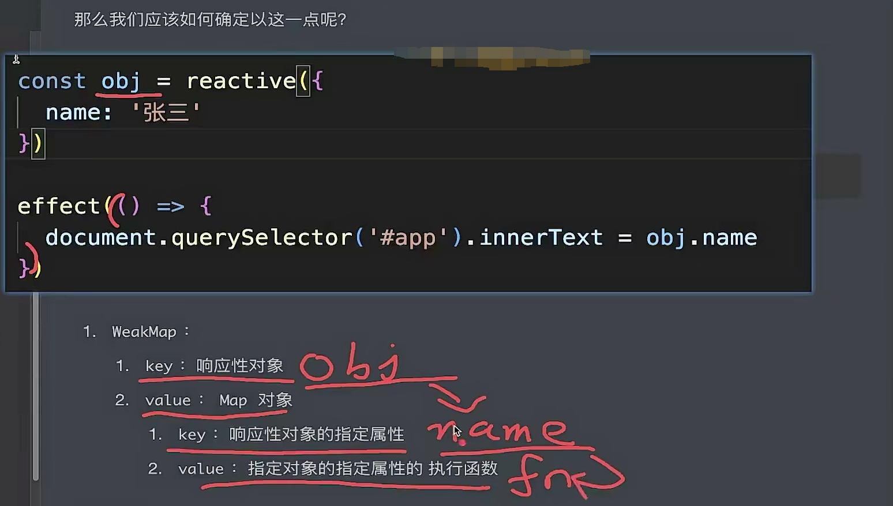

# Reactivity

## Javascript 程序性

> 所有的编程语言都有一套固定且不会发生变化的执行流程

```typescript
const product = {
  price: 10,
  quantity: 2,
};

const totalPrice = product.price * product.quantity;
console.log(totalPrice); // 20

product.quantity = 5;
console.log(totalPrice); // 20, how can calculate  10 * 5 ? to make reactivity!
```

## Vue2 中的响应式

> [Object.defineProperty](https://developer.mozilla.org/en-US/docs/Web/JavaScript/Reference/Global_Objects/Object/defineProperty)

该方法的缺陷是：

1. 当为对象新增一个没有在 data 中声明的属性时，新增的属性不是响应式的

2. 当为数组通过下标的形式新增一个元素时，新增的元素不是响应式的

为什么有这样的缺陷？

因为 `Object.defineProperty` 需要明确接收对象以及对象属性（key name）

## Vue3 中的响应式

> [Proxy](https://developer.mozilla.org/en-US/docs/Web/JavaScript/Reference/Global_Objects/Proxy)

proxy 并不要求指定属性，其创建对象代理后对该代理对象实现基本操作的拦截和自定义（如属性查找、赋值、枚举、函数调用等）。

### Reflect

> Reflect 是一个内置的对象，它提供拦截 JavaScript 操作的方法。这些方法与 proxy handler 的方法相同。Reflect 不是一个函数对象，因此它是不可构造的。

当希望监听代理对象的 getter/setter 时，不应该使用 `target[property]`，因为某些情况下（如 fullname，代理对象内部使用 this）下是不可靠的。从而应使用 proxy，借助它的 get/set 方法，使用 receiver（proxy 实例）作为 getter/setter 的 this 达到期望的结果

## 什么是 WeakMap？它和 Map 有什么区别？

二者的共同点是均为 key/value 的结构对象。但是对于 WeakMap 而言，存在俩个不同的地方：

1. key 必须是对象

2. key 是弱引用

> 弱引用不会影响垃圾回收，即 WeakMap 的 key 不存在任何引用时，会被直接回收。强引用会影响垃圾回收。存在强引用的对象永远不会被回收。

## 什么是响应式？

setter 时执行 fn 函数，getter 收集 fn 函数



## 缺陷

1. 只能赋值对象

2. 解构后失去响应性（getter/setter 行为没了）
